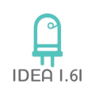

# GabineteTV-movil

Archivos y docuemntos necesarios para la construcción y mantenimiento de un gabinete elevador de TV

# Descripción

lonX=2010mm=2.01m=2m y 1cm
lonY=440mm=0.44m=44cm
lonZ=1300mm=1.3m=1m y 30cm

## OpenSCAD

#Como contribuir

El propósito de hacer un repositorio de códigos de OpenSCAD de código parametrizable es aumentar la experiencia de uso y poder realizar modelos 3D dinámica y con aplicaciones prácticas

Para poder contribuir es necesario tener una cuenta de gitlab para poder realizar un fork a éste repositorio y posteriormente los cambios serán revisados por los administradores y posteriormente integrados o regresados para revisión

Cada proyecto debe estar contenido en una carpeta y se recomienda que en cada proyecto existan subcarpetas llamadas OpenSCAD, PNG, 3Dprint,STL y DXF (en algunos casos), en el caso de las dos últimas carpetas que tengan ejemplos de dxf y stl, además de ello que se inluya un archivo README.md en el cual se describa la función y/o motivo del proyecto en cuestión.

# Código de Conducta

En los diseños y o modelos 2D y 3D no debe contener contenido inapropiado o de mal gusto, esto es contener groserías palabras antisonantes o modelos con contenido explícito o inadecuado para audiencias sensibles.

## IDEA 1.61

{ width=100% } 

https://idea161.org/

https://www.thingiverse.com/

https://www.youtube.com/channel/UCXwIW7z5ys3FRVoOducFSeQ

contacto@idea161.org

## Social

https://www.instagram.com/idea161/

https://www.facebook.com/idea161/

TelegramChannel t.me/idea161

## Responsiva
          
Esta contribución es con el fin de hacer un aporte a la comunidad y de ayuda a la construcción.
Después de leer los Factores a considerar, nosotros no nos hacemos responsables por algún inconveniente, esperando que estos modelos sean de su agrado.

## Anuncio Legal

IDEA1.61 AVISO LEGAL © Copyright IDEA1.61 2018. Todos los derechos reservados. El logotipo de IDEA1.61 es una obra protegida por derechos de autor.
AVISO LEGAL DE DITAC © Copyright Ditac 2018. Todos los derechos reservados. El logotipo de Ditac es una obra protegida por derechos de autor.

